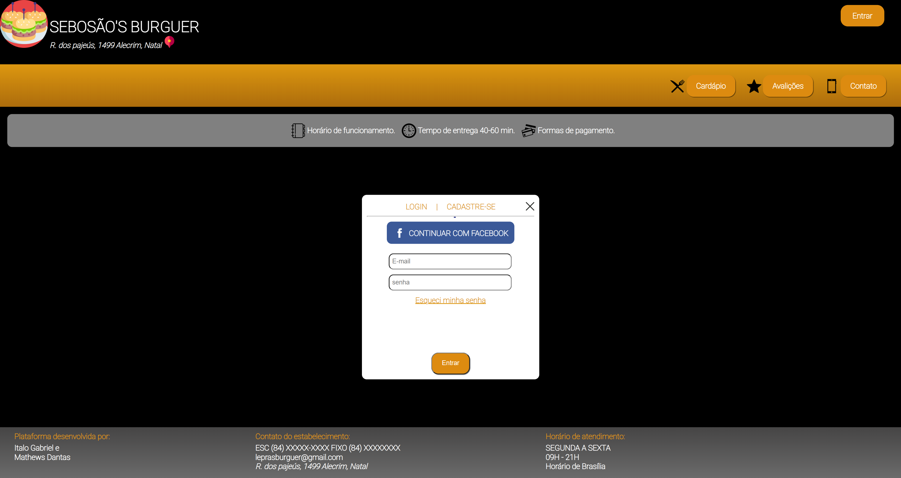

<h1 align="center">SEBOSAO'S BURGUER</h1>

# Descrição do Projeto

Primeiro projeto utilizando os conhecimentos de HTML/CSS. Esse site foi desenvolvido no primeiro semestre para disciplina de WebDesign, foi escolhido um site de hamburgueria para a prática.

### Features

- [x] Cardápio.
- [x] Avaliações. 
- [x] Contato.
- [x] Carrinho.
- [x] Login.
- [ ] Adicionar produtos ao carrinho.

### Pré-requisitos

Antes de começar, você vai precisar ter instalado em sua máquina as seguintes ferramentas:
Ter um bom editor para trabalhar com o código como [VSCode], ou apenas executar o arquivo index em seu navegador. 

### Autor
---

<a href="https://media-exp1.licdn.com/dms/image/C4D03AQESwDNM3nKE7Q/profile-displayphoto-shrink_800_800/0/1643322714520?e=1655942400&v=beta&t=diJ_Jutzlw6KS9jKOpsRHpUCVw1oVUb4z8VC0R_lJp8">
 
  
 <b>Mathews Dantas</b></a> <a href="https://blog.rocketseat.com.br/author/thiago//" title="Rocketseat">🚀</a>

Feito por Mathews Dantas 👋🏽 Entre em contato!

 
 
 

 
